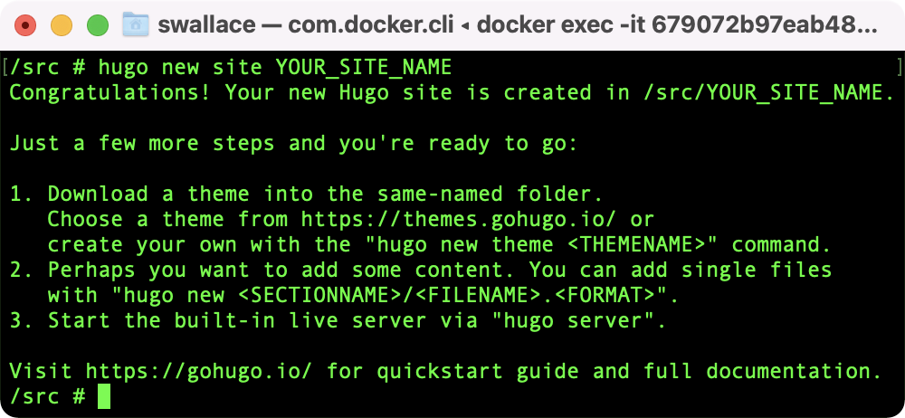
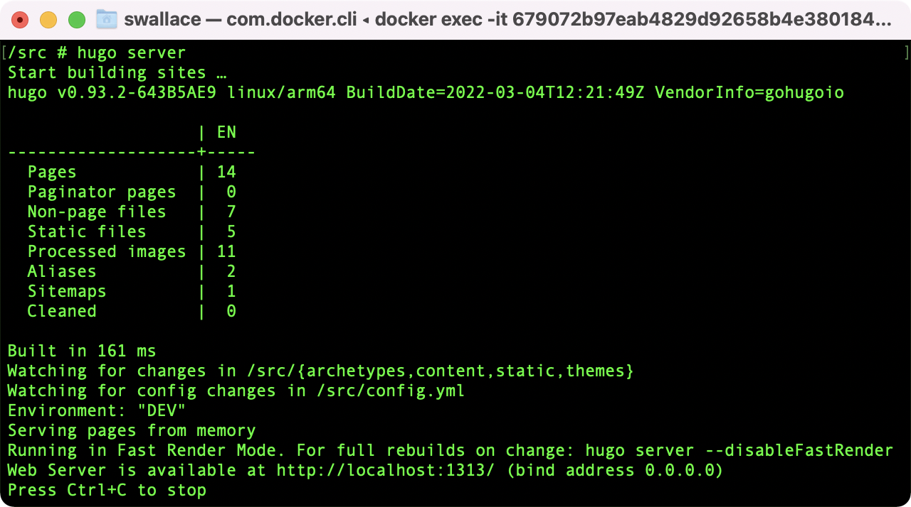

## Overview
It seems appropriate that my first post on this site be an exploration of its own technical underpinnings. That being said, before I get too far into the weeds, a bit of context. When I set out to build my site I had a few goals in mind. Those goals can be reasonably summed up as wanting to self-host a site using docker containers, with the whole thing built from a git repo of markdown files stored in Github. Unpacking that a bit:

* Self-Host
  * Run all the website infrastructure in my home, and avoid paying a hosting provider like Squarespace or Wix, as nice as those tools can be.
* Write all my posts in [markdown](https://daringfireball.net/projects/markdown/)
  * Markdown enables easy text-formatting, and allows me to do my writing in any number of great, markdown-supporting text-editors on basically any computing platform.
* Run all infrastructure in containers
  * Running my web-hosting infrastructure entirely inside docker containers allows me to easily change what computer is running my website (if/when that becomes necessary or desirable). Migrating to another computer I own, to a Virtual Private Server (VPS) I rent, or to the Cloud with Azure/AWS container hosting-- it all becomes trivial.
* Store the site as a git repository in Github
  * Site files being a git repo in Github provides me with backups, and quick visibility into updates I make to my site over time. Along with docker containers, it makes it easy to move my site to a new host because I don't have to worry about transferring site files manually. All I have to do is initiate a git clone of my site's Github repo on the new host, and the site files are ready to go!

With those goals in mind, I eventually landed on using [Hugo](https://gohugo.io) to build my site, and the [NGINX Proxy Manager](https://nginxproxymanager.com) docker container to host it to the web from my home. If you would like to do something similar, and build a site like the one you are currently viewing, the below should be helpful! With that out of the way, lets begin.

## Requirements
In order to successfully build and host using this method, the below are prerequisites:

1. Own a domain name. Mine is [wallacelabs.tech](https://wallacelabs.tech). If you do not already own one, I recommend purchasing from [Hover](https://www.hover.com) or [Google Domains](https://domains.google).
    * As part of owning a domain, you will have control of your domain's DNS records. If you somehow own a domain but do not have the ability to manage its DNS records, you'll have to get that worked out before proceeding.
2. Own an internet-connected computer. This computer will be your web-server. Ideally, that computer will be a server in the sense that it is always on, and dedicated to server functions. While you could host your website on your everyday use computer, I would not recommend it.
    * In terms of actual hardware though? It can be basically anything from a tiny Raspberry Pi to a massive EPYC Server. The important thing is that it can run docker, and is always on.
3. The ability to manage port-forwarding rules on your network's router/gateway. This, along with control of your domain's DNS records, are essential in mapping traffic pointed at your domain from over the internet to the computer hosting your website.

If you can check all those boxes, you should be good to go.

## Phase One - Getting the Site Running Locally
Before worrying about domain DNS records, web hosting, and port-forwarding rules, we're first going to focus on getting a site running on your local network. First, we'll setup the web-server.

### Installing Docker
Our goal here is to setup your server to act as a Docker host. The Operating System (OS) you choose is mostly up to your preference, as Docker can be run on Windows, macOS, or Linux.

> *A quick aside: If you plan on using your Web-Server as a general purpose home server, it is definitely worth considering the security implications of running a web host on the same computer you use for other general purpose tasks. By using a computer for web hosting, you are inherently opening up this system to the internet, and there is a lot to be said for isolating a web-host system through any variety of means. A thorough consideration of these potential risks, and the network hardening measures which might be taken to mitigate them, is outside the scope of this discussion. A post for another day, perhaps. For now though, suffice it to say that our risk factor here is not particularly large, due primarily to the fact that we will be hosting a static site, rather than a dynamic one. Had I opted to host a dynamic site using Wordpress, or something of the like, I would be singing a different tune. For additional reading on the security implications of static vs. dynamic sites, [see here](https://srandby.org/digital-writing/index.html#randby-process).*

Begin by [installing the Docker Engine](https://docs.docker.com/engine/install/) using the instructions specific to your OS. With Docker installed, we can now begin setting up the first container we'll be using.

### Setting up a Hugo container

To create the site, we will be using the [Hugo Docker Container](https://hub.docker.com/r/klakegg/hugo/). Hugo's Docker-Hub image is highly configurable, offering many different tags for specialized integration into custom web-publishing workflows. For our use, all we really want is basic container which, when run, provides an interactive shell environment where we can run Hugo commands. The below docker compose file will accomplish this:



Go ahead and download that file. Update the volume mapping from ``*PATH TO SITE*`` to wherever you would like your site's git repo to live on the host system. Open up a Terminal/Powershell session, navigate to whichever folder ``docker-compose.yml`` has been downloaded to, and run the following command:

```bash
docker-compose up
```

You should see the following in your Terminal session:



Now open up Docker Desktop, and you should see your container running, like in this picture:



With the Hugo container setup and ready to go, we can now use it to create your site.

### Building your Site

Now we're in business. Click the "CLI" button in Docker Desktop to open up a CLI session on your running container. This is how you'll interact with the Hugo program running inside the container. To start, we need to create a new site. Your CLI session will have opened up inside the containers ``/src`` folder by default. Lucky us, this is exactly where we want to be, no navigating to a different directory needed. Run the below command, and a blank Hugo site template will be initialized as a git repo inside the ``/src`` folder. Just be sure to change ``*YOUR_SITE_NAME*`` to whatever you would like to call the repo containing your site.

```bash
hugo new site *YOUR_SITE_NAME*
```

The site will be generated, and you will see the below message in your CLI session:



Next up, as indicated in that success message, you'll need to [pick a theme](https://themes.gohugo.io) and install it. There are tons to choose from-- the site you are viewing now is running on [PaperMod](https://themes.gohugo.io/themes/hugo-papermod/). The theme you choose will provide its own installation instructions. These instructions usually consist of installing the theme as a git-submodule. This method is convenient as it allows easily updating your theme by initiating a git pull on that submodule. Put more simply- you'll have a one-click method of updating to a new version of your chosen theme in the future, should you want to do so. Just make sure to run any necessary commands inside the Hugo container's CLI. With a blank Hugo site template created and your theme installed, the foundation of your site is in place.

### Creating your first post
Next up, we're going to create a quick test post. Before that though, a brief rabbit-trail about Leaf Bundles.

#### To Leaf-Bundle, or not to Leaf-Bundle

> In a moment, I'm going to have you run a command that will create the first blog post on your newly created site. That command is going to create the post as something Hugo calls a [Leaf Bundle](https://gohugo.io/content-management/page-bundles/). I recommend creating all your posts as a leaf bundle because, among other benefits, it allows you to bundle images that are displayed in your post in the same folder as the markdown file that makes up the post itself. If you did not create your Posts as leaf bundles, then all images for all your posts will be lumped together, completely disorganized, inside a folder named ``static`` at the root level of your site folder. The below diagrams should help visualize this:

**Leaf Bundle Post Structure**
>```text
>content/
>└──posts
>    └── YOUR_POST_NAME
>        ├── image1.png
>        ├── image2.png
>        └── index.md

**Non-Leaf Bundle Post Structure**
>```text
>content/
>├── posts
>│   ├── my-post.md
>│   └── my-other-post.md
>└── static
>    ├── my-post_image1.png
>    ├── my-post_image2.png
>    ├── my-post_image3.jpg
>    ├── my-other-post_image1.png
>    └── my-other-post_image2.jpg

I highly prefer the structure provided by the leaf bundle method, and I think you will too. Now, back to the business of creating your first post.

#### Creating a post (As a Leaf-Bundle)
Run the below command in the Hugo container CLI to create a test post on your site:

```bash
hugo new content/posts/*YOUR_POST_NAME*/index.md
```

If you wish, feel free to modify index.md to add a quick "hello world" message, or something of the like, but do not feel obligated. Your first post has been created, whether it has anything written in it or not.

### Hosting your Site! (Locally)
Hugo includes a web-server for running a site on your local network. Why would you want to run a site locally? It allows previewing how your site will appear prior to publishing it to the web. We're going to take advantage of that now. Run the below command (again, inside the Hugo Container CLI):

```bash
hugo server
```

With luck, you'll be greeted with the following message:



Open [http://localhost:1313](http://localhost:1313) in your browser of choice to view your site!

> If you were not so lucky, you may have gotten an error in your CLI session that says something like "Check your Hugo installation: you need the extended version to build...". This is because some themes require an extended version of the Hugo docker container in order to build successfully. Remember earlier, when I said the Hugo image is highly configurable, has many tags, blah blah blah? Here we have another example of that. If this happens to you, change line 3 of ``docker-compose.yml`` from ``image: klakegg/hugo:latest`` to ``image: klakegg/hugo:ext-alpine``. Shut down your container, relaunch it using ``docker-compose up``, and you should be good to go.

## Phase Two - Hosting your Site on the Web!


## Phase Three - Quality of Life Recommendations

### Configure Additional Development Environments
This may sound counterintuitive, but I would recommend setting up as additional development environment on your everyday computer to do most of your site development on--setting up the site, testing changes, writing posts, etc. Then, whenever you are ready to publish, you push your changes up to your Github repo, and pull them down on the web server. Boom, published. This is how I personally develop for my site most of the time. On my laptop, I use the Atom text editor
