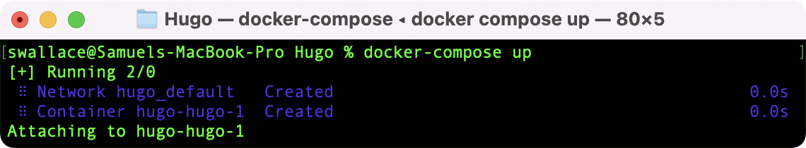

## Overview
It seems appropriate that my first post on this site be an exploration of its own technical underpinnings. That being said, before I get too far into the weeds, a bit of context. When I set out to build my site, my goal was to self-host it using docker containers, with the whole site built from a git repo of markdown files stored in Github. Unpacking that a bit:

* Self-Host
  * Run all the website infrastucture in my home, and avoid paying a hosting provider like Squarespace or Wix, as nice as those tools can be.
* Write all my posts in [markdown](https://daringfireball.net/projects/markdown/)
  * Enables easy text-formatting, and allows me to do my writing in any number of great, markdown-supporting text-editor on basically any computing platform.
* Run all infrastucture in containers
  * Running my webhosting infrastucture entirely inside docker containers allows me easily change what computer is running my website (if/when that becomes necessary or desirable). Migrating to another computer I own, to a Virtual Private Server (VPS) I rent, or to the Cloud with Azure/AWS container hosting-- it all becomes trivial.
* Store the site as a git repository in Github
  * Site files being a git repo in Github provides me with backups, and quick visibility into updates I make to my site over time. Along with docker containers, it makes it easy to move my site to a new host because I don't have to worry about transfering site files manually. All I have to do is initiate a git clone of my site's Github repo on the new host, and the site files are ready to go!

With those goals in mind, I eventually landed on using [Hugo](https://gohugo.io) to build my site, and the [NGINX Proxy Manager](https://nginxproxymanager.com) docker container to host it to the web from my home. If you would like to do something similar, and build a site like the one you are currently viewing, the below should be helpful! With that out of the way, lets get into it.

## Requirements
In order to successfully build and host using this method, the below are prerequisites:

1. Own a domain name. Mine is [wallacelabs.tech](https://wallacelabs.tech). If you do not already own one, I recommend purchasing from [Hover](https://www.hover.com) or [Google Domains](https://domains.google).
    * As part of owning a domain, you will have control of your domain's DNS records. If you somehow own a domain but do not have the ability to manage its DNS records, you'll have to get that worked out before proceeding.
2. Own an internet-connected computer. This computer will be your web-server. Ideally, that computer will be a server in the sense that it is always on, and dedicated to server functions. While you could host your website on your everyday use computer, I would not recommend it.
    * In terms of actual hardware though? It can be basically anything from a tiny Raspberry Pi to a massive EPYC Server. The important thing is that it can run docker, and is always on.
3. The ability to manage port-forwarding rules on your network's router/gateway. This, along with control of your domain's DNS records, are essential in mapping traffic pointed at your domain from over the internet to the computer hosting your website.

If you can check all those boxes, you should be good to go.

## Phase One - Getting the Site Running Locally
Before worrying about domain DNS records, web hosting, and port-forwarding rules, we're first going to focus on getting a site running on your local network. First, we'll setup the web-server.

### Prepareing Your Web-Server.
Our goal here is to setup your server to act as a Docker host. The Operating System (OS) you choose is mostly up to your preference, as Docker can be run on Windows, macOS, or Linux.

> *A quick aside: If you plan on using this Web-Server as a general pupose home server, I would recommend the [Unraid OS](https://unraid.net). For the unfamiliar, Unraid is a Linux-based OS purpose built for home server and Network-Attached-Storage (NAS) functionality. That being said-- it is definitly worth considering the security implications of running a web host on the same computer you use for other general purpose tasks. By using a computer for web hosting, you are inherintly opening up your system to the internet. There is a lot to be said for isolating your webhost through any variety of means; However, a thorough consideration of these potential risks, and the network hardening measures which might be taken to mitigate them, is outside the scope of this disucssion. A post for another day, perhaps. For now, suffice it to say that our risk factor here is not particularly large, due in large part to the fact that we will be hosting a static site, rather than a dynamic one. Had I opted to host a dynamic site using Wordpress, I would be singing a different tune. [See here](https://srandby.org/digital-writing/index.html#randby-process) for additional reading on the security implications of static vs. dynamic sites.*

Begin by [installing the Docker Engine](https://docs.docker.com/engine/install/) using the instructions specific to your OS (If you do happen to be using Unraid, Docker is already installed). Once Docker is installed, we're going to setup a development environment for your site by setting up a few contaniers.

### Configuring the Development Environment
Now we're going to build the site using the [Hugo Docker Container](https://hub.docker.com/r/klakegg/hugo/). This image on Docker Hub is highly configurable for integration into custom web-publishing workflows. For our use, we'd like to have a basic container which, when run, provides an interactive shell environment in which we can run hugo commands. The below docker compose file acomplishes this:



Go ahead and download that file. Update the volume mapping from ``*PATH TO SITE*`` to whereever you would like to create your site's git repo on the host system, and save it to a new folder. Open up a Terminal/Powershell session at that new folders location and run the following command:

```bash
docker-compose up
```

You should see the following in your Terminal session and in Docker Desktop:




### Configure Additional Development Environments
This may sound counterintuitive, but I would reccomend setting up as additioanl development enviornment on your everyday computer to do most of your site development on--setting up the site, testing changes, writing posts, etc. Then, whenever you are ready to publish, you push your changes up to your Github repo, and pull them down on the web server. Boom, published. This is how I personally develop for my site most of the time. On my laptop, I use the Atom text editor

Testing
